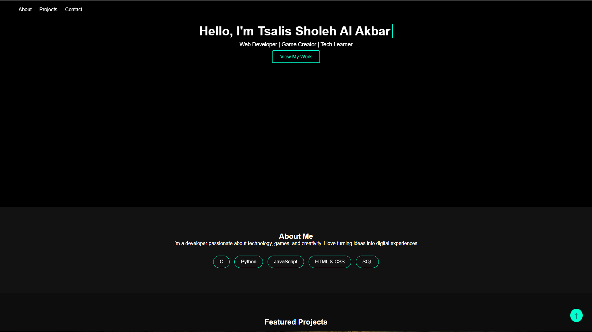

<h1 align="center">🌐 Tsalis Sholeh Al Akbar – Portfolio Website</h1>

<p align="center">
  
  
  
  
</p>

<h3 align="center">
  <a href="https://tsalis-dev.github.io/portofolio/">🚀 Live Demo 🚀</a>
</h3>

<p align="center">
  A modern portfolio website showcasing my profile, skills, and projects in the world of web development.
</p>

---

## 🧠 About Me
Hello! I'm **Tsalis Sholeh Al Akbar**, a student and aspiring software developer with a focus on **web development** and **creative coding**.
I love building projects that combine aesthetic design with functional logic.

> *"Code is not just logic — it's art written in syntax."*

---

## 🛠️ Tech Stack
| Category | Tools |
|-----------|--------|
| Frontend | HTML5, CSS3, JavaScript |
| Design | Figma, Canva |
| Version Control | Git, GitHub |
| IDE | Visual Studio Code |

---

## 📁 Project Structure
| Portfolio | Function |
|-----------|--------|
| index.html | Main page |
| style.css | Styling and animations |
| script.js | Effects and interactivity |

---

## 🚀 Key Features
- Responsive (mobile-friendly) design
- Smooth animations with CSS and JavaScript
- Simple and easily scalable structure
- Ready to be deployed on GitHub Pages

---

## 🧩 Getting Started / Running Locally
```bash
# Clone this repository
git clone [https://github.com/tsalis-dev/portofolio.git](https://github.com/tsalis-dev/portofolio.git)

# Navigate to the project directory
cd portofolio

# Open in your browser
start index.html
```

---

## 📸 Preview


